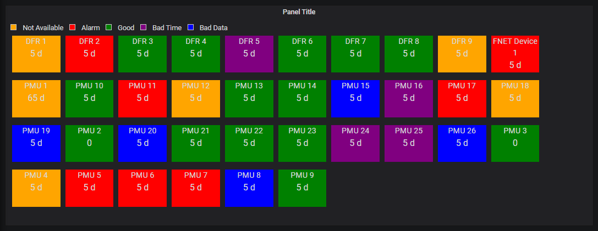

# Overview

This plugin is a Grana panel to show the status of all PMUs connected to the openHistorian.
For this Panel to work the openHistorian Data Source plugin has to be installed and set-up and the openHistorian has to be installed.

# Description

Each connected PMU is displayed as a box in this panel. The color of each Box indicates the status of the PMU. The following states are defined:
- Good State (Green): This is the simplest state to describe, it simply means that no alarm state is active.
- Alarm State (Red): This state means no data has been received over a configured period.
- Not Available State (Yellow): This state represents a “warning” state meaning data is not currently available (or old), but it has not reached the configured alarm period, i.e., “on its way to alarm state if nothing changes”. The alarm state time period is reached much more quickly than the alarm state. This is important since a device may simply be in a restarting state, or the PDC system may be failing over during patching. The configuration values for reaching not available are defined with lead and lag time tolerances. The Not Available state takes precedence over Bad Data.
- Bad Data State (Blue): This state means that one of devices in the connection group is consistently reporting bad data, i.e., the device is self-reporting a bad data flag – the openHistorian is not currently trying to deduce data quality for the purposes of alarming. In the case of IEEE C37.118, this means that bit 15 of the status flags has been set. For other protocols, e.g., IEEE 1344, this will be bit 14. The Bad Data state takes precedence over Bad Time.
- Bad Time State (Purple): This state means that one of the devices in the connection group is consistently report bad time, i.e., the device is self-reporting a bad time flag – or, the openPDC finds that the measurement time is consistently outside of configured time tolerances as compared to the local system clock– this catches devices with a floating clock, as can often happen with daylight savings time transitions. Note that for bad time states triggered solely on the basis of old timestamps will be superseded by Not Available state once data has been detected to be consistently stale. In the case of IEEE C37.118, the bad time flag is bit 13 of the status flags. Like in the case of Bad Data, the actual bit will be different for other protocols.
- Out of Service State: This state simply represents that a device has been disabled through configuration and is currently not reporting data.
- Acknowledged State: When a device is in any alarm state, the dashboard user can change the alarm to “acknowledged” to mean that the alarm is known and being worked. If the alarm state consistently transitions to “Good” for a configured period, the acknowledged state will be automatically cleared – otherwise the acknowledged state will remain until manually reset.

## Settings

A full description of all available Settings can be found [here](./Settings.md) 

## Setup

A general guide to set up the openPDC and Grafana data source plugin can be found [here](./Setup.md)

