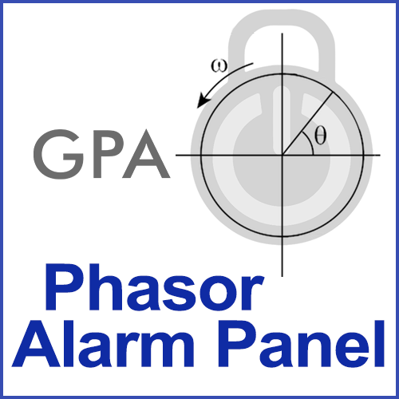

# Settings

### Grafana Panel Settings
The following Settings are available in the Grafana plugin:
* **Panel Link Adress**: This link is used to access the Device Status Page of the openPDC when the user clicks on any of the devices in the panel. The Device Status page provides additional information about the PMU and its connection status.
For instance, if the PDC is running on a server `127.1.1.1` with the default port settings, then this link should be set to `http://127.1.1.1:8280/`

* **Device Name Filter**: This filterexpression is used to filter the devices shown on the panel. If the expression is left blank all devices are shown. The expression is based on [REGEX](https://regexr.com/) and is applied to the device names.
For instance if only devices starting with `GPA- ` should be shown the expression would be `$GPA- `.

### openPDC adapter Settings
In addition to the Grafana panel there is a number of settings in the [openPDC Action Adapter](./Setup.md) that has to run on the associated openPDC to ensure the panel works.
The relevant adapter settings are:
* **Target Parent Devices**: Defines the flag that determines if alarm states should only target parent devices, i.e., PDCs and direct connect PMUs, or all devices.
* **AcknowledgedTransitionHysteresisDelay**: Defines the delay time, in minutes, before transitioning the Acknowledged state back to Good.
* **AlarmMinutes**: Defines the time, in minutes, for which to change the device state to alarm when no data is received.

These settings are adjusted in the connection string of the `Device Alarm State` action adapter.
