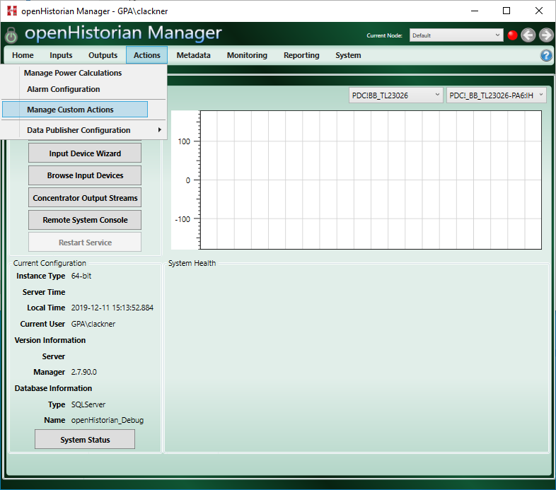
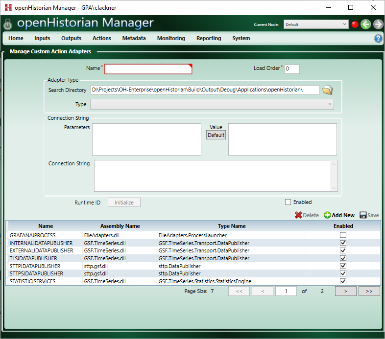
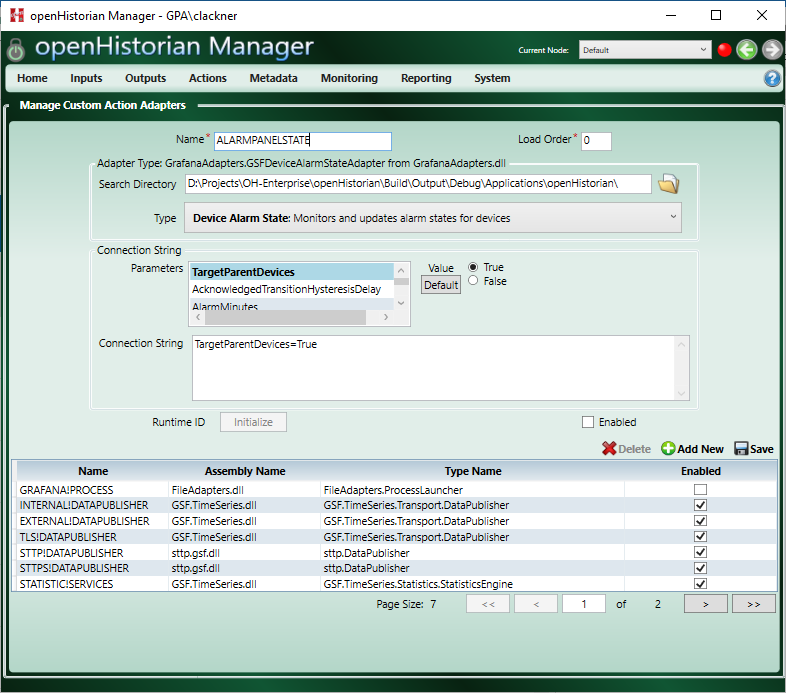
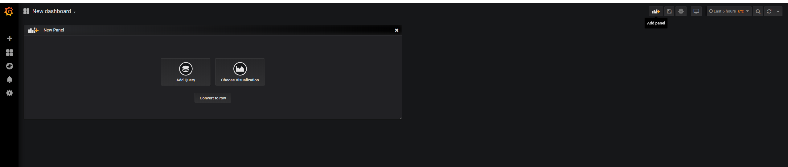
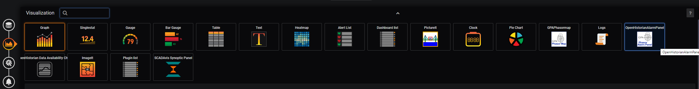
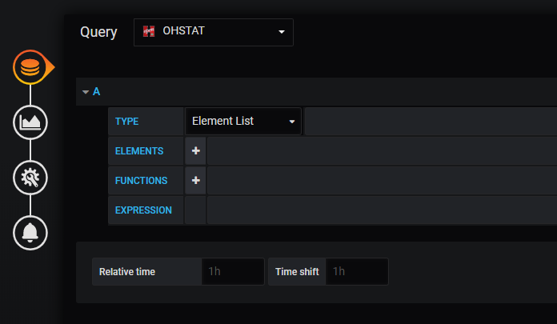
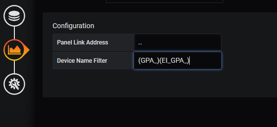



# Setup

This describes the setup process to get the Grafan Panel to display the status of all devices connected to the openHistorian. If using the openPDC the setup process is very similar.
Note that these instruction assume the [openHistorian](https://github.com/gridProtectionAlliance/openHistorian)  version `2.7.90` or greater is installed (or [openPDC](https://github.com/gridProtectionAlliance/openPDC) version `2.8.60`). In addition it is assumed Grafana version 6.5.0 or greater with the openHistorian [data-source plugin](https://grafana.com/grafana/plugins/gridprotectionalliance-openhistorian-datasource/installation) is installed (included in the openHistorian installation).

## Setup of the Action Adapter
First the `Device Alarm State` action adapter has to be setup in the openHistorian. To do so start the openHistorian Manager and Click on *Manage Custom Actions* in the **Actions** tab

Next add a new action adapter by clicking on *Add New*

The adapter should be of type `Device Alarm State` and the following settings are necesarry, the values are only suggested and can be changed. Additionally the setting listed [here](./Settings.md) can be adjusted to customize the device status.
* **Name**: AlarmPanelState
* **TargetParentDevices**: True

Note that the adapter also needs to be Enabled before saving it by clicking on *Save*

## Setup of the Grafana Plugin
Note that these instructions assume the Data-source Plugin has been setup or the Grafana instance included in the openHistorian is used.
After setting up the action adapter the Phasor Alarm Panel can be added to a dashboar in Grafana. To add the panel click *Add Panel* in the upper right corner of Grafana.
Then click *choose Visualization* and pick the *OpenHistorianAlarmPanel*

To finish the setup make sure the **OHSTAT** (or if using the openPDC the **PDCSTAT**) Datasource is selected.

This example also includes the use of the filter to only show devices whose name starts with `GPA_` or `EI_GPA_` to achive that, type `(GPA_)(EI_GPA_)` into the *Device Name Filter* textbox.

